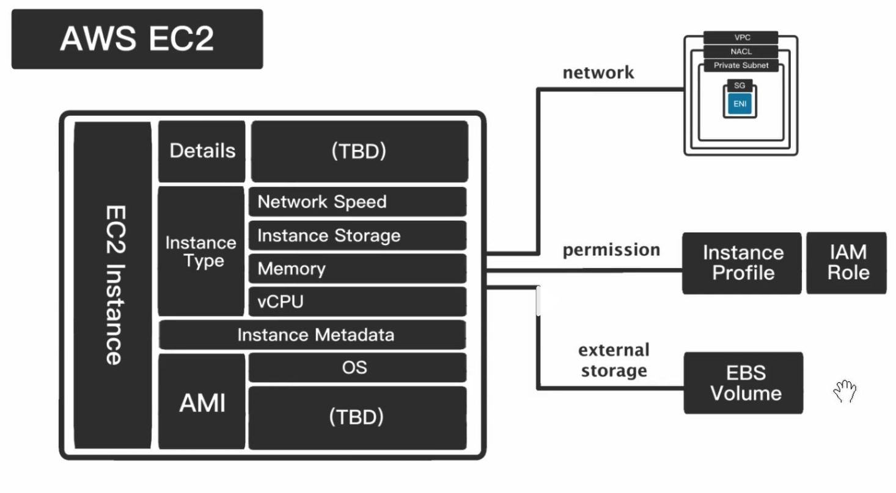

# EC2 基礎設施

## EC2 是什麼

- EC2 是 AWS 提供的一種虛擬機器服務，允許用戶在 AWS 雲端中建立自己的虛擬機器。
- EC2 提供了更高的安全性和控制，因為用戶可以設定哪些資源可以互相通訊。

## EC2 組成

### AMI (Amazon Machine Image)

- AMI 是 EC2 的基礎鏡像，包含了作業系統、應用程式和配置。
- AMI 可以是 AWS 提供的，也可以是用戶自己創建的。
- AMI 包含了作業系統、應用程式和配置，讓用戶可以快速部署虛擬機器。
- AMI 可以根據需要進行自定義，例如安裝特定的應用程式或設定特定的安全性設定。
- AMI 的優點包括：
  - 快速部署：使用 AMI 可以快速部署虛擬機器，無需從頭開始設定。
  - 一致性：AMI 保證了虛擬機器的設定是一致的，減少了設定錯誤的風險。
  - 可重複使用：AMI 可以重複使用，減少了設定和部署的時間和成本。

### Instance Metadata

- Instance Metadata 是 EC2 實例的元數據，包含了實例的詳細信息，例如：
  - 實例 ID
  - 實例類型
  - AMI ID
  - 實例狀態
  - 實例的安全群組
  - 實例的 VPC 和子網路
  - 實例的網路接口
- Instance Metadata 可以通過 HTTP 連接到 `http://169.254.169.254/latest/meta-data/` 來訪問。(需要在 EC2 Instance 透過連結取得 metadata)
- Instance Metadata 的優點包括：
  - 提供了實例的詳細信息，方便管理和監控。
  - 可以用於自動化實例的設定和配置。
  - 可以用於實現實例之間的通訊和協作。

### Instance Type

- Instance Type 是 EC2 實例的類型，例如：
  - Instance Storage
    - 可以選擇是否要使用 Instance Storage，如果選擇使用，則需要選擇 Instance Storage 的大小。
    - Instance Storage 的優點包括：
      - 提供了更高的性能，因為 Instance Storage 是直接連接到 EC2 實例的。
      - 提供了更高的可靠性，因為 Instance Storage 是直接連接到 EC2 實例的。
    - Instance Storage 會隨著 EC2 實例的停止而消失
  - vCPU
  - Memory
  - Network Speed

### Instance Profile

- Instance Profile 是 EC2 實例和 IAM 角色之間的橋梁，讓 EC2 實例可以安全地擁有 IAM 角色的權限。Instance Profile 包含了：
  - 實例 ID
  - 實例類型
  - AMI ID
  - 實例狀態
  - IAM 角色名稱
  - IAM 角色的權限
- Instance Profile 的優點包括：
  - 提供了實例的詳細信息，方便管理和監控。
  - 可以用於自動化實例的設定和配置。
  - 可以用於實現實例之間的通訊和協作。

### Elastic Block Storage (EBS)

- EBS 是 AWS 提供的一種網路儲存服務，允許用戶在 AWS 雲端中建立自己的儲存卷。
- EBS 提供了更高的安全性和控制，因為用戶可以設定哪些資源可以互相通訊。
- EBS 並不會隨著 EC2 實例的停止而消失，需要手動刪除。
- EBS 的優點包括：
  - 提供了實例的詳細信息，方便管理和監控。
  - 可以用於自動化實例的設定和配置。
  - 可以用於實現實例之間的通訊和協作。