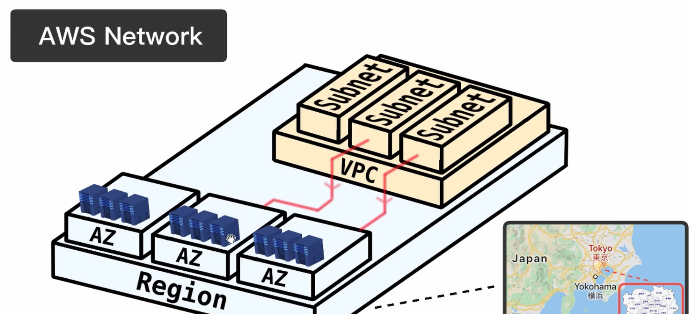
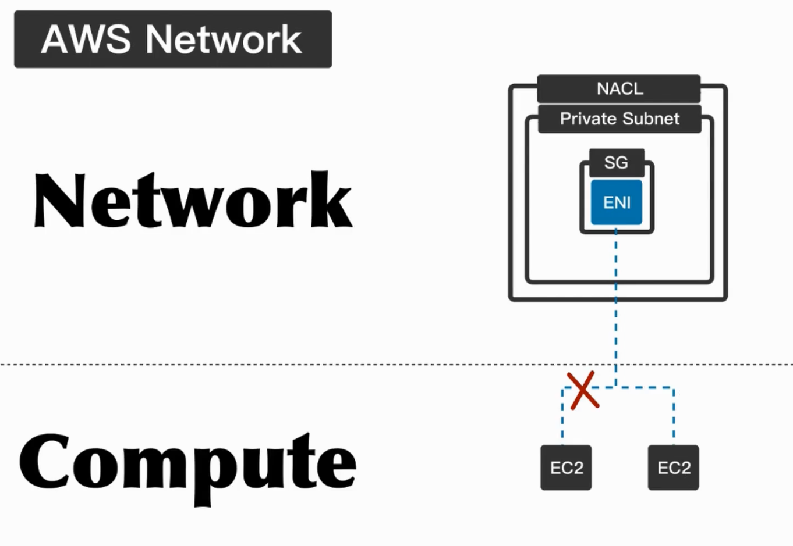
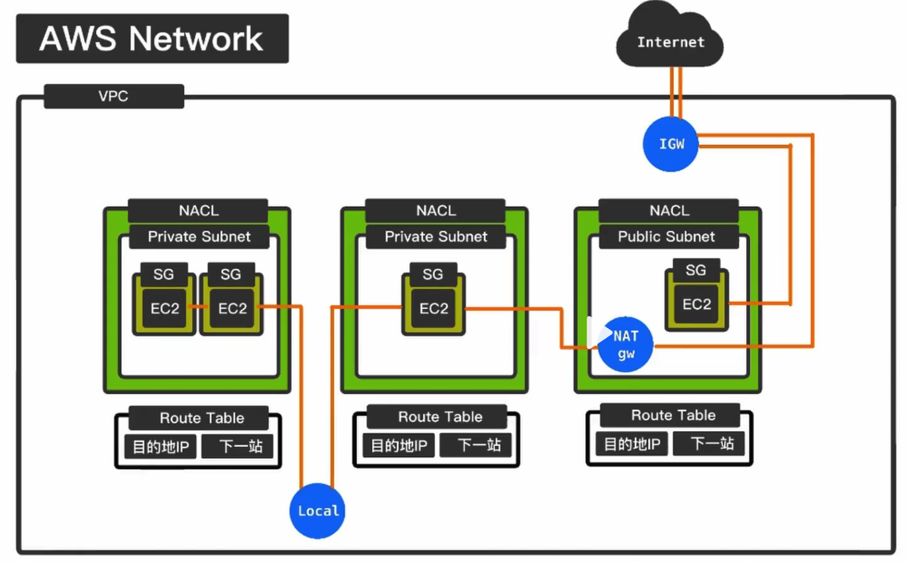

# VPC 基礎設施

1. 一個 Region (例如us-east-1) 會有多個 AZ (例如us-east-1a, us-east-1b, us-east-1c)
2. AZ 的概念是一個 Logical Data Center，是同一個 Region 內的獨立區域，擁有自己的電源供應和網路基礎設施，會有多個實體 Data Center

# VPC

## VPC 是什麼

VPC (Virtual Private Cloud):

- VPC 是 AWS 提供的一種虛擬網路服務，允許用戶在 AWS 雲端中建立自己的私有網路。
- 用戶可以定義 IP 位址範圍、建立子網路、配置路由表和網路閘道等。
- VPC 提供了更高的安全性和控制，因為用戶可以設定哪些資源可以互相通訊。

## Subnet 是什麼

- Subnet 是 VPC 中的一個子網路，允許用戶將 VPC 的 IP 位址範圍劃分為更小的區域。
- 每個 Subnet 必須位於一個特定的可用區 (AZ) 中。
- Subnet 可以是公共的（可以直接訪問 Internet）或私有的（無法直接訪問 Internet）。
- AWS 建議在不同的 AZ 中建立多個 Subnet，以提高高可用性（High Availability）。

## Route Table 是什麼

- Route Table 是 VPC 的路由表，允許用戶定義哪些資源可以互相通訊。
- 每個 VPC 可以有多個 Route Table。
- 有兩個重要設定
  - 目的地 IP 位址
  - 下一站
- 以下是 Route Table 的主要用處：
  - 定義流量路由：確定流量如何在 VPC 內部和外部進行路由。
  - Local 路由：自動處理同一 VPC 內的資源之間的通訊。
  - NAT Gateway 路由：允許 Private Subnet 的 EC2 實例通過 NAT Gateway 訪問 Internet。
  - VPN 和 Direct Connect 路由：定義與其他網路（如本地數據中心）之間的連接。
  - 流量控制：可以根據需要添加或修改路由條目，以控制流量的流向。

## Internet Gateway 是什麼

- Internet Gateway 是 VPC 與 Internet 之間的閘道，允許用戶的資源訪問 Internet。
- 每個 VPC 只能有一個 Internet Gateway。
- 需要將 Internet Gateway 連接到 Route Table 才能讓 VPC 的資源訪問 Internet。

## NAT Gateway 是什麼

- NAT Gateway 是 VPC 與 Internet 之間的閘道，允許用戶的資源訪問 Internet。
- 每個 VPC 可以有多個 NAT Gateway。
- 在同一個 VPC 下，不同的公共子網是可以共用同一個 NAT GW。
- 私有子網與公共子網也可以使用同一個 NAT GW，但公共子網通常不需要使用 NAT GW 來訪問 Internet。

## Network Access Control List (NACL) 是什麼

- NACL 是 VPC 的網路訪問控制列表，允許用戶定義哪些資源可以互相通訊。
- NACL 可以在 Subnet 層面上進行設定，控制進出 Subnet 的流量。
- NACL 的規則是無狀態的，意味著它們不會追蹤連接的狀態。****
- NACL 的規則可以是允許或拒絕，且可以根據源 IP 地址、目的 IP 地址、通訊協定、埠號等進行設定。
- NACL 的規則會按照順序進行評估，第一個匹配的規則將會被應用。

## Security Group 是什麼

- Security Group 是 VPC 的網路訪問控制列表，允許用戶定義哪些資源可以互相通訊。
- Security Group 類似於防火牆，能夠控制進出 EC2 實例的流量。
- Security Group 可以在 EC2 實例層面上進行設定，針對特定實例控制流量。
- Security Group 的規則是狀態感知的，意味著它們會追蹤連接的狀態，允許回應流量。
- Security Group 的規則可以是允許或拒絕，且可以根據以下條件進行設定：
  - 源 IP 地址
  - 目的 IP 地址
  - 通訊協定（如 TCP、UDP、ICMP）
  - 埠號（如 HTTP 的 80 埠、HTTPS 的 443 埠）
- 每個 Security Group 可以包含多個規則，並且可以將多個 Security Group 附加到同一個 EC2 實例上，以提供更細緻的流量控制。
- Security Group 的規則是累加的，意味著只要有一條規則允許流量，該流量就會被允許通過。
- 當 EC2 實例啟動時，會自動附加預設的 Security Group，該組的規則會阻止所有進入流量，僅允許所有出站流量。

## ENI(Elastic Network Interface) 是什麼

- ENI 是 VPC 的網路接口，允許用戶在 VPC 中建立多個網路接口，並且可以將多個 ENI 附加到同一個 EC2 實例上。
- ENI 可以提供更高的網路性能和更好的網路管理。
- ENI 與 EC2 之間的關係
  - 每個 EC2 實例至少有一個主網路接口（eth0），可以附加額外的 ENI 以擴展網路功能。
  - 附加的 ENI 可以用於不同的用途，例如分隔流量、提供冗餘或實現安全性分區。
  - ENI 可以在 EC2 實例之間移動，允許用戶在不同的實例之間重新配置網路接口。

# VPC 架構

## 結構

- VPC 中的 Subnet 可以分為 Public Subnet 和 Private Subnet
- Subnet 都會對應一個 Route Table

## 不同 Subnet 之間的通訊情況

| Subnet 類型          | EC2 通訊情況                     | 訪問 Internet 情況          | 備註                          |
|---------------------|----------------------------------|-----------------------------|-------------------------------|
| 同一個 Private Subnet | 可以互相通訊                     | 不能訪問 Internet           | 使用 local 路由              |
| 同一個 Public Subnet  | 可以互相通訊                     | 可以訪問 Internet           | 使用 local 路由              |
| 不同 Private Subnet   | 可以互相通訊                     | 不能訪問 Internet           | 使用 local 路由              |
| 不同 Public Subnet    | 可以互相通訊                     | 可以訪問 Internet           | 需要透過 IGW 或 NAT          |
| Private Subnet 與 Public Subnet | 需要透過 NAT Gateway 通訊 | 透過 NAT Gateway 訪問 Internet |                               |

## NAT Gateway 與 Internet Gateway 的比較

| 特性                     | Internet Gateway (IGW)                     | NAT Gateway (NAT GW)                     |
|------------------------|------------------------------------------|-----------------------------------------|
| 主要功能                 | 允許 VPC 的資源直接訪問 Internet          | 允許私有子網的資源訪問 Internet         |
| 訪問方式                 | 直接訪問                                  | 通過 NAT 轉換 IP 地址                    |
| 支援的子網類型           | 公共子網                                  | 私有子網                                 |
| 數量限制                 | 每個 VPC 只能有一個 IGW                   | 每個 VPC 可以有多個 NAT GW               |
| 連接方式                 | 需要連接到 Route Table                    | 需要連接到 Route Table       

## NACL 與 Security Group 的比較

| 特性                     | NACL                                   | Security Group                           |
|------------------------|----------------------------------------|-----------------------------------------|
| 主要功能                 | 控制進出 Subnet 的流量                  | 控制進出 EC2 實例的流量                  |
| 訪問方式                 | 直接訪問                                | 通過狀態感知的方式進行訪問               |
| 規則狀態                 | 無狀態（不追蹤連接狀態）                | 有狀態（追蹤連接狀態）                   |
| 規則評估                 | 按順序評估，第一個匹配的規則生效        | 所有規則累加，只要有一條規則允許流量通過 |
| 設定層級                 | Subnet 層級                             | EC2 實例層級                             |
| 數量限制                 | 每個 VPC 可以有多個 NACL                | 每個 VPC 可以有多個 Security Group      |
| 預設行為                 | 預設拒絕所有流量                        | 預設允許所有出站流量，拒絕所有進入流量   |
| 適用場景                 | 適合於需要細粒度控制的網路流量管理      | 適合於 EC2 實例的安全性管理              |
| 進出規則                 | 進出皆會驗證                             | 僅驗證進入流量                            |
