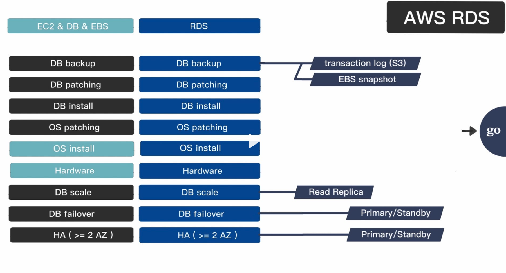
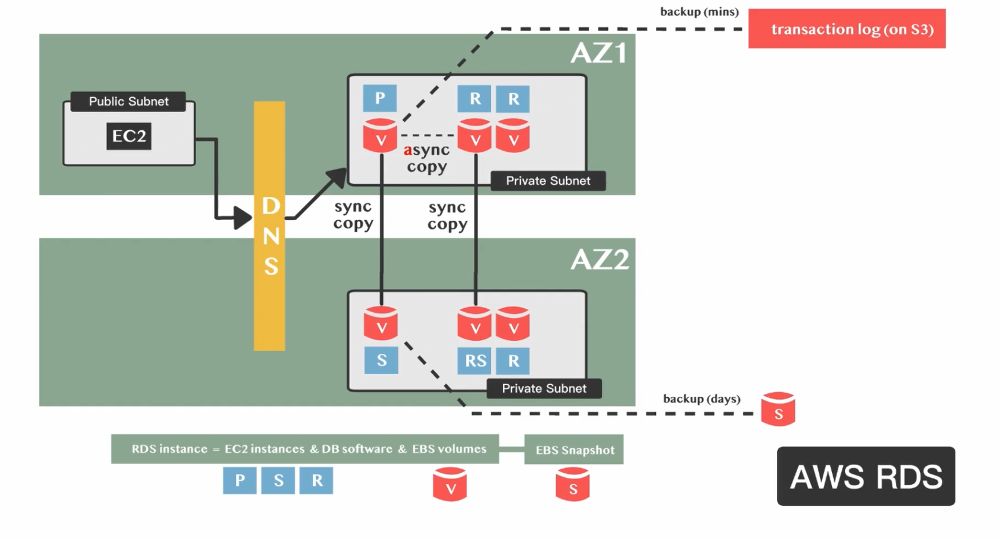

# RDS

## RDS 與 EC2 的功能比較

## RDS 架構

- RDS 其實就是 EC2 & DB & EBS 的組合
- 其中會有 Primary、Standby、Replica 三個角色
- 其中 Primary 是主機，Standby 是備援機，Replica 是分擔 Primary 的讀取壓力
- Primary 會將資料`同步`到 Standby (sync copy)
- Primary 會將資料`非同步`到 Replica (async copy)
- 不同 AZ 之間的 Replica 可以不做同步
- 一般運作下不會使用到 Standby，直到 Primary 掛掉，Standby 才會接手

## RDS 備份

- Transaction Log Backup
  - 記錄所有資料庫的變更
  - 可客製化備份時間
- Snapshot
  - 快照備份，可手動或自動
- Failover
  - 當 Primary 掛掉，Standby 會接手
- Read Replica
  - 分擔 Primary 的讀取壓力
  - 可設定同步或非同步