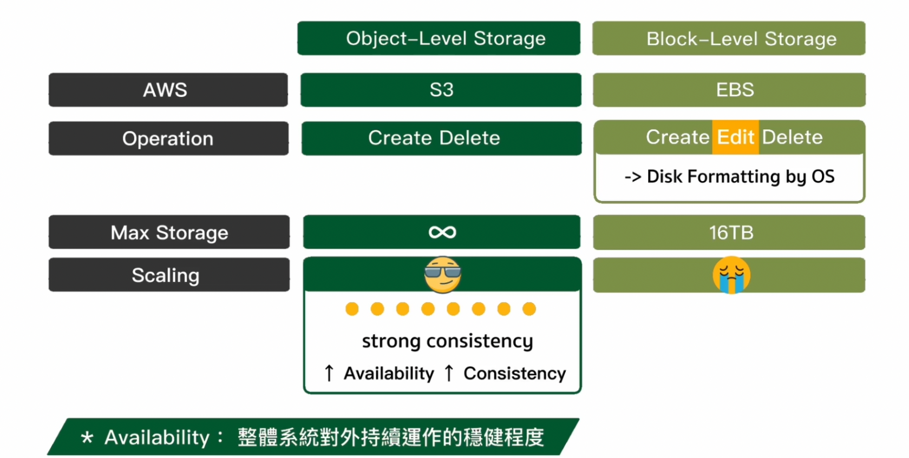
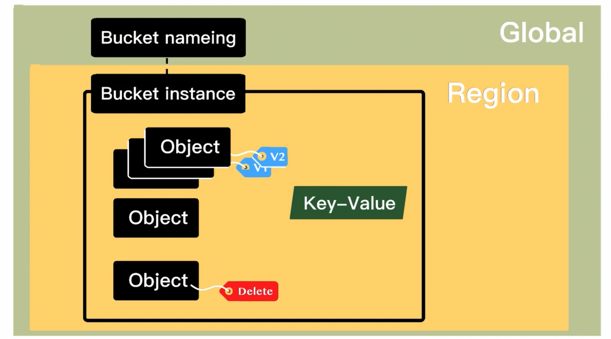
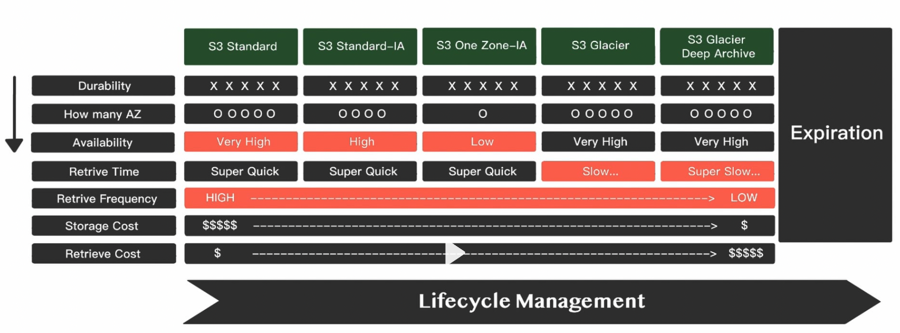

# S3

## 什麼是 S3

- S3 是 AWS 提供的一種物件儲存服務(Object level storage)，可以儲存和檢索任意大小的資料。

## S3 vs EBS

## S3 架構 & 版本控管

- 會需要在 Global 建立一個 Bucket 來儲存資料(為一個跨 region 的儲存空間)
- Bucket Name 需要是全域唯一
- Bucket 創建後會對應產生一個 Bucket Instance，可以儲放許多 Object
- Object 為一個 key-value 的儲存方式
- Versioning 為一個 Bucket 的版本控管，可以針對 Object 進行版本控管，會對於每個 Object 進行標籤

## S3 儲存類別 & Lifecycle

- Lifecycle 為一個 Bucket 的 Lifecycle 控管，可以針對 Object 進行生命週期控管，例如：
  - 將 Object 從 Standard 轉換為 Glacier
  - 將 Object 從 Glacier 轉換為 Standard
  - 將 Object 從 Standard 轉換為 Onezone IA
  - 將 Object 從 Onezone IA 轉換為 Standard
  - 將 Object 從 Standard 轉換為 Intelligent-Tiering
